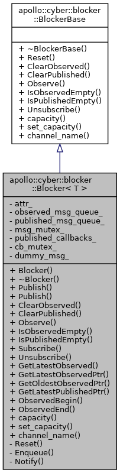
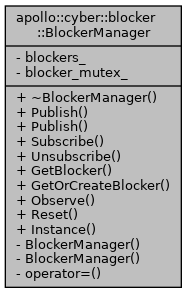

# Blocker



## 成员变量

```cpp
using MessageType = T;
using MessagePtr = std::shared_ptr<T>;
using MessageQueue = std::list<MessagePtr>;
using Callback = std::function<void(const MessagePtr&)>;
using CallbackMap = std::unordered_map<std::string, Callback>;
using Iterator = typename std::list<std::shared_ptr<T>>::const_iterator;

 BlockerAttr attr_;
 MessageQueue observed_msg_queue_;
 MessageQueue published_msg_queue_;
 mutable std::mutex msg_mutex_;

 CallbackMap published_callbacks_;
 mutable std::mutex cb_mutex_;

 MessageType dummy_msg_;
```


## Publish

消息入队列 Enqueue(msg)  +  通知 Notify(msg)  

头插尾出，有容量限制

## Observe

观测即拷贝一份published_msg_queue_，只是指针的拷贝

```cpp
template <typename T>
void Blocker<T>::Observe() {
  std::lock_guard<std::mutex> lock(msg_mutex_);
  observed_msg_queue_ = published_msg_queue_;
}
```

## Notify

执行注册好的 cb

```cpp
template <typename T>
void Blocker<T>::Notify(const MessagePtr& msg) {
  std::lock_guard<std::mutex> lock(cb_mutex_);
  for (const auto& item : published_callbacks_) {
    item.second(msg);
  }
}
```

## Subscribe 

IntraReader调用

```cpp
template <typename T>
bool Blocker<T>::Subscribe(const std::string& callback_id,
                           const Callback& callback) {
  std::lock_guard<std::mutex> lock(cb_mutex_);
  if (published_callbacks_.find(callback_id) != published_callbacks_.end()) {
    return false;
  }
  published_callbacks_[callback_id] = callback;
  return true;
}
```


# BlockerManager



## Subscribe

```cpp
template <typename T>
bool BlockerManager::Subscribe(const std::string& channel_name, size_t capacity,
                               const std::string& callback_id,
                               const typename Blocker<T>::Callback& callback) {
  auto blocker = GetOrCreateBlocker<T>(BlockerAttr(capacity, channel_name));
  if (blocker == nullptr) {
    return false;
  }
  return blocker->Subscribe(callback_id, callback);
}
```


# IntraReader

## Subscribe 

设置回调

```cpp
template <typename MessageT>
bool IntraReader<MessageT>::Init() {
  if (this->init_.exchange(true)) {
    return true;
  }
  return BlockerManager::Instance()->Subscribe<MessageT>(
      this->role_attr_.channel_name(), this->role_attr_.qos_profile().depth(),
      this->role_attr_.node_name(), std::bind(&IntraReader<MessageT>::OnMessage,
                                              this, std::placeholders::_1));
}
```

