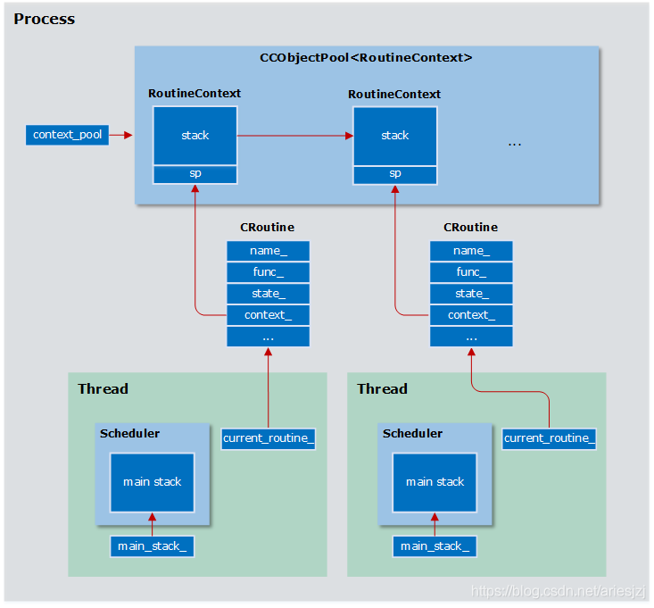
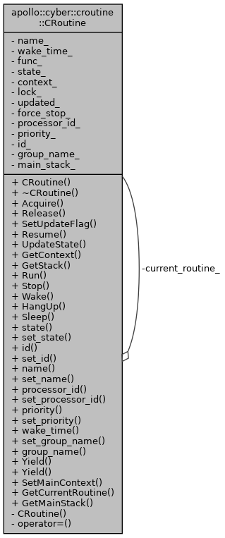
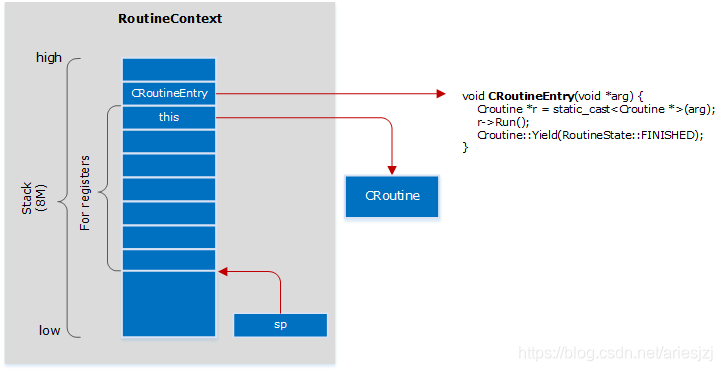
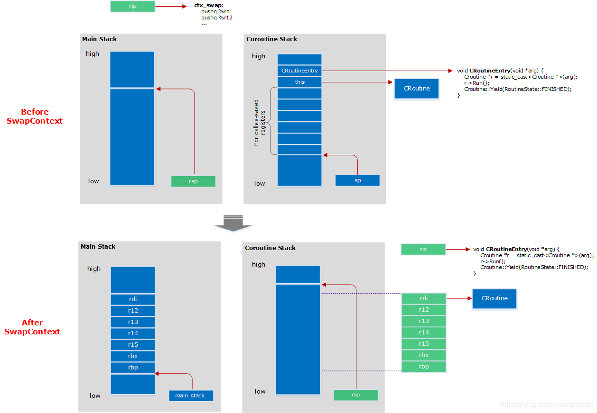
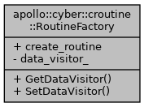

[自动驾驶平台Apollo 3.5阅读手记：Cyber RT中的协程（Coroutine）](https://blog.csdn.net/jinzhuojun/article/details/86760743)

# CRoutine #

非共享栈、非对称，写汇编进行上下文切换





## MakeContext ##



## SwapContext ##

ctx_swap(reinterpret_cast<void\**>(src_sp), reinterpret_cast<void**>(dest_sp));

传递参数时，依次通过 %rdi, %rsi, %rdx, %rcx, %r8, %r9 来传递

```cpp
.globl ctx_swap
.type  ctx_swap, @function
ctx_swap:
	  //把物理寄存器上的内容放入主栈
      pushq %rdi   //RESUME: 将rdi-rbp等参数依次压入系统栈
      pushq %r12
      pushq %r13
      pushq %r14
      pushq %r15
      pushq %rbx
      pushq %rbp
      movq %rsp, (%rdi)// 保存栈顶指针rsp到第一个传入参数rdi中 

      //栈顶指针指向协程栈，及切换到协程栈，把协程栈上的内容搬到物理寄存器，执行入口函数
      movq (%rsi), %rsp// 栈顶指针指向第二个参数所指向的栈(该栈由makecontext得到，入口函数即为CRoutineEntry)，将rbp-rdi依次出栈放入对应的寄存器，
      popq %rbp
      popq %rbx
      popq %r15
      popq %r14
      popq %r13
      popq %r12
      popq %rdi
      ret

```



# 总结 #

与另一种常见并发编程手段-线程不同，协程是由用户自己来做任务的切换（故又称“用户级线程”）。因此可以在单线程下实现高并发，是一种更细粒度的并发。它有自己的优缺点：

- 优点：一是上下文切换效率很高，因为切换对于kernel来说是无感知的，不需陷入kernel space，其切换开销基本和函数调用差不多；二是协程间共享数据不用加锁，因为它们还是在一个线程上跑，并不会真正并行执行；三是能用同步的风格写异步的逻辑，不会callback满天飞。

- 缺点：一是本质上任务还是在一个线程上执行，无法利用多CPU的并行能力，因此实际当中多还是和线程结合使用。二是一旦一个协程开跑，除非它自己交出控制权，否则没法被其它协程抢占。如果这个协程还block了，那就很不幸了。。。

# RoutineFactory #




一个DataVisitorBase和一个协程函数。

```cpp
template <typename M0, typename F>
RoutineFactory CreateRoutineFactory(
    F&& f, const std::shared_ptr<data::DataVisitor<M0>>& dv) {
  RoutineFactory factory;
  factory.SetDataVisitor(dv);
  factory.create_routine = [=]() {
    return [=]() {
      std::shared_ptr<M0> msg;
      for (;;) {
        CRoutine::GetCurrentRoutine()->set_state(RoutineState::DATA_WAIT);
        if (dv->TryFetch(msg)) {
          f(msg);
          CRoutine::Yield(RoutineState::READY);
        } else {
          CRoutine::Yield();
        }
      }
    };
  };
  return factory;
}
```

Reader Init时，将数据到来时的回调(协程)放入调度器中执行

```cpp
croutine::RoutineFactory factory =
    croutine::CreateRoutineFactory<MessageT>(std::move(func), dv);
if (!sched->CreateTask(factory, croutine_name_)) {
  AERROR << "Create Task Failed!";
  init_.exchange(false);
  return false;
}
```

