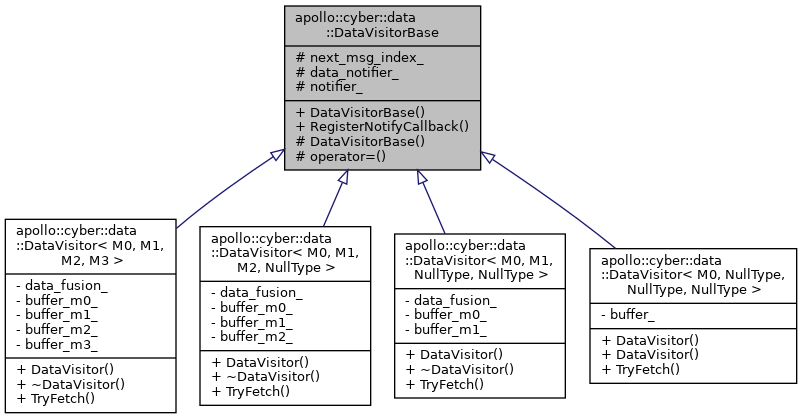

# DataVisitor #

## DataVisitorBase ##




```cpp
uint64_t next_msg_index_ = 0;
DataNotifier* data_notifier_ = DataNotifier::Instance();
std::shared_ptr<Notifier> notifier_;
```

## DataVisitor ##

## 成员变量 ##

```cpp
ChannelBuffer<M0> buffer_;//visitor 就是一个ChannelBuffer
```


```cpp
DataVisitor(uint64_t channel_id, uint32_t queue_size)
    : buffer_(channel_id, new BufferType<M0>(queue_size)) {
  DataDispatcher<M0>::Instance()->AddBuffer(buffer_);
  data_notifier_->AddNotifier(buffer_.channel_id(), notifier_);
  //channel_id 和 notifier_绑定 
  //当该channle_id有数据时，即DataDispatcher<T>::Dispatch 分派数据时
  //会执行 notifier_->Notify(channel_id), 执行notifies 对应的所有回调
  //对于读节点来说:该回调在Scheduler::CreateTask中创建 即 this->NotifyProcessor(task_id)
  //通知调度器执行对应的协程任务，任务内容为TryFetch: 取CacheBuffer中的数据,执行读节点的read_func
}
```


# DataNotifier #

**单例类**

## AddNotifier ##

给对应的channel添加notifier

## Notify ##

channel_id的消息来了，通知到监听对应channel的notifiers，依次执行notifier的cb

# DataDispatcher #

**带模板参数的单例类**

```cpp
DataDispatcher<M0>::Instance()
```

## Dispatch ##

派发消息，派发完毕后Notify

## AddBuffer ##

添加派发对象

# ChannelBuffer #

内含一个`CacheBuffer`，有`Fetch `, `Latest` ,`FetchMulti`等方法。就是**带channel_id的CacheBuffer**

# CacheBuffer #

类似一个ringbuffer，0 1 2 3 4 0 1 2 3 4 依次放入元素。ring的结构导致可以Cache capcity个元素

