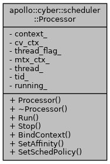
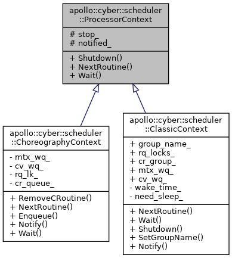

# scheduler

**子类单例类**


## 成员变量

```cpp
std::unordered_map<uint64_t, std::mutex> id_cr_wl_;
std::mutex cr_wl_mtx_;

AtomicRWLock id_cr_lock_;
std::unordered_map<uint64_t, std::shared_ptr<CRoutine>> id_cr_;
std::vector<std::shared_ptr<ProcessorContext>> pctxs_;
std::vector<std::shared_ptr<Processor>> processors_;

uint32_t proc_num_ = 0;
uint32_t task_pool_size_ = 0;
std::atomic<bool> stop_;
```

子类调度器需要实现 `DispatchTask`  `RemoveTask` `NotifyProcessor` ` RemoveCRoutine` 等方法，调度器就是派发任务，删除任务，通知处理单元执行某个任务，管理协程等功能

```cpp
virtual bool RemoveTask(const std::string& name) = 0;
virtual void SetInnerThreadAttr(const std::thread* thr,
                                const std::string& name) {}

virtual bool DispatchTask(const std::shared_ptr<CRoutine>&) = 0;
virtual bool NotifyProcessor(uint64_t crid) = 0;
virtual bool RemoveCRoutine(uint64_t crid) = 0;
```


## SchedulerClassic 经典调度器

**经典调度器，单例类**

### CreateProcessor

根据协程组配置创建对应的处理单元(线程)，同时绑定上下文

### DispatchTask

1记录 2根据协程的组名和优先级 派发到全局队列中

```cpp
ClassicContext::cr_group_[cr->group_name()].at(cr->priority()).emplace_back(cr); 
```

### RemoveCRoutine

从调度列表中删除协程对应id，从任务队列中删除对应协程


## SchedulerChoreography 编排调度器

**编排调度器，单例类**

# Processor



```cpp
std::shared_ptr<ProcessorContext> context_;
std::condition_variable cv_ctx_;
std::once_flag thread_flag_;
std::mutex mtx_ctx_;
std::thread thread_;
std::atomic<pid_t> tid_{-1};
std::atomic<bool> running_{false};
```

## BindContext

```cpp
// 绑定上下文时，启动线程函数 ---> 找上下文取协程任务执行
void Processor::BindContext(const std::shared_ptr<ProcessorContext>& context) {
  // 1. 协程执行的上下文信息，会随着协程切换而切换
  context_ = context;
  // 2. 绑定Processor到具体的线程
  std::call_once(thread_flag_,
                 [this]() { thread_ = std::thread(&Processor::Run, this); });
}
```


# ProcessorContext

处理器上下文，子类需要实现`NextRoutine` `Shutdown` `wait`方法。

可以返回下一个需要执行的协程，或者等待下一个可执行的协程。协程的上下文保存在协程栈的内部，实现上有一个内部的协程队列




## ClassicContext

经典上下文

```cpp
alignas(CACHELINE_SIZE) static RQ_LOCK_GROUP rq_locks_;
alignas(CACHELINE_SIZE) static CR_GROUP cr_group_;

alignas(CACHELINE_SIZE) static GRP_WQ_MUTEX mtx_wq_;
alignas(CACHELINE_SIZE) static GRP_WQ_CV cv_wq_;
```

### NextRoutine

```cpp
for (int i = MAX_PRIO - 1; i >= 0; --i) { // 在自己绑定的协程组(group_name)中，从高到低去协程组的优先级队列中取任务 19是最高优先级 0 最低
  ReadLockGuard<AtomicRWLock> lk(rq_locks_[group_name_].at(i));
  for (auto& cr : cr_group_[group_name_].at(i)) { // 从相同优先级队列中 遍历协程任务
    if (!cr->Acquire()) {
      continue;
    }
    if (cr->UpdateState() == RoutineState::READY) {
      PerfEventCache::Instance()->AddSchedEvent(SchedPerf::NEXT_RT, cr->id(),
                                                cr->processor_id());
      return cr;
    }
    if (unlikely(cr->state() == RoutineState::SLEEP)) {
      if (!need_sleep_ || wake_time_ > cr->wake_time()) { //取较小的时间，醒来后肯定有任务能执行
        need_sleep_ = true;
        wake_time_ = cr->wake_time();
      }
    }
    cr->Release();
  }
}
```


## ChoreographyContext

编排上下文
