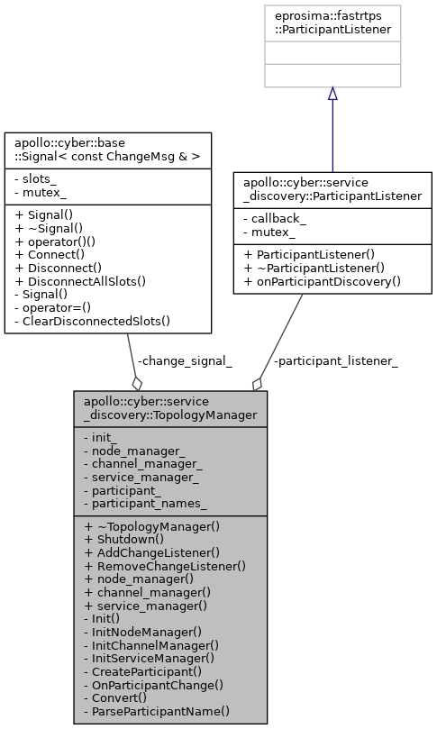
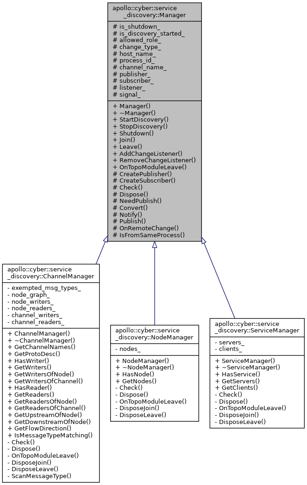

# TopologyManager 

**单例类**



## Init

```cpp
  node_manager_ = std::make_shared<NodeManager>();
  channel_manager_ = std::make_shared<ChannelManager>();//在单例类中，这些指针也相当于单例
  service_manager_ = std::make_shared<ServiceManager>();

  CreateParticipant(); //?
```

## CreateParticipant

服务发现中添加自己的 "host_ip + pid" 为标识。有变化后 ChangeMsg 回调到OnParticipantChange

```proto
syntax = "proto2";

package apollo.cyber.proto;

import "cyber/proto/role_attributes.proto";

enum ChangeType {
    CHANGE_NODE = 1;
    CHANGE_CHANNEL = 2;
    CHANGE_SERVICE = 3;
    CHANGE_PARTICIPANT = 4;
};

enum OperateType {
    OPT_JOIN = 1;
    OPT_LEAVE = 2;
};

enum RoleType {
    ROLE_NODE = 1;
    ROLE_WRITER = 2;
    ROLE_READER = 3;
    ROLE_SERVER = 4;
    ROLE_CLIENT = 5;
    ROLE_PARTICIPANT = 6;
};

message ChangeMsg {
    optional uint64 timestamp = 1;
    optional ChangeType change_type = 2;
    optional OperateType operate_type = 3;
    optional RoleType role_type = 4;
    optional RoleAttributes role_attr = 5;
};

```


## OnParticipantChange

收到某个标识离线后。node_manager_下线对应的 **node/channel/service**，emit变化信号

```cpp
void TopologyManager::OnParticipantChange(const PartInfo& info) {
  ChangeMsg msg;
  if (!Convert(info, &msg)) {
    return;
  }

  if (!init_.load()) {
    return;
  }

  if (msg.operate_type() == OperateType::OPT_LEAVE) {
    auto& host_name = msg.role_attr().host_name();
    int process_id = msg.role_attr().process_id();
    node_manager_->OnTopoModuleLeave(host_name, process_id);
    channel_manager_->OnTopoModuleLeave(host_name, process_id);
    service_manager_->OnTopoModuleLeave(host_name, process_id);
  }
  change_signal_(msg);
}
```


# Manager



Manager 需要子类去实现 **Dispose**等方法。使用基于rtps的发布订阅，实现全网络的node，channel，service的变化互联


## ChannelManager

