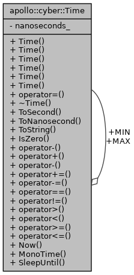

# Time #



两个静态变量，三个静态函数

```cpp
static const Time MAX;
static const Time MIN;
static Time Now();          // high_resolution_clock::now();
static Time MonoTime();     // steady_clock::now();
static void SleepUntil(const Time& time);//睡到几点
```

**steady_clock** 是单调的时钟，相当于教练手中的秒表；**只会增长**，适合用于记录程序耗时；
**system_clock** 是系统的时钟；因为**系统的时钟可以修改**；甚至可以网络对时； 所以用系统时间计算时间差可能不准。
**high_resolution_clock** 是当前系统能够提供的最高精度的时钟；它也是不可以修改的。相当于 **steady_clock 的高精度版本**。

# Rate #

```cpp
  Time start_;//开始时间
  Duration expected_cycle_time_;//期望循环时间
  Duration actual_cycle_time_;  //实际时间
```

# Duration #

