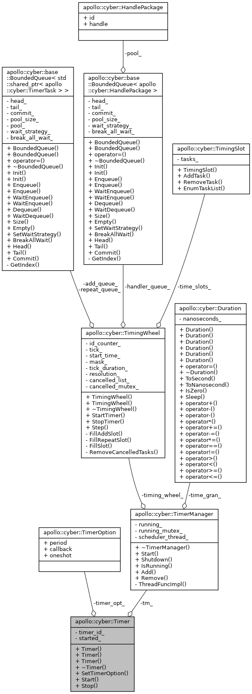

# 定时器实现 #

timer.h  timer_manager.h  timer_task.h  timing_slot.h  timing_wheel.h



相比游戏中多级时间轮实现的定时器后，apollo的时间轮定时器的实现比较简单。

# Timer #

每个timer都回指TimerManager单例，start时由TimerManager分配id，删除定时器即操作该id

```cpp
struct TimerOption {
  uint32_t period;                 // The period of the timer, unit is ms
  std::function<void()> callback;  // The tasks that the timer needs to perform
  bool oneshot;  // True: perform the callback only after the first timing cycle 指定是不是一次性的定时器任务
                 // False: perform the callback every timed period
};

Timer::Start
Timer::Stop
```

# TimerManager #

负责定时器的添加和删除，内部最核心的是**TimingWheel**类对象，该类在TimerManager的工作线程中按照**time_gran_**步进

```cpp
  Rate rate(time_gran_);
  while (running_) {
    timing_wheel_.Step();
    rate.Sleep(); //时间轮的tick，sleep固定时间的方式，待改进，没有充分利用cpu
  }
```

# TimingWheel #

单级时间轮

```cpp
  BoundedQueue<std::shared_ptr<TimerTask>> add_queue_;    //BoundedQueue 无🔒有界队列
  BoundedQueue<std::shared_ptr<TimerTask>> repeat_queue_; //
  BoundedQueue<HandlePackage> handler_queue_;             //
```

# TimerTask #

INIT = 0, CANCELED, EXPIRED 三态的任务。Fire方法即执行一次任务。

# TimingSlot #


```cpp
// 执行slot中到点的任务, 其中 hander_queue 异步执行的任务
// rep_queue 重复执行的任务
void TimingSlot::EnumTaskList(
    uint64_t deadline, bool async, BoundedQueue<HandlePackage>* hander_queue,
    BoundedQueue<std::shared_ptr<TimerTask>>* rep_queue) {
  for (auto it = tasks_.begin(); it != tasks_.end();) {
    auto task = it->second;  // *it;
    auto del_it = it;
    it++;
    // std::cout << "judge: task->" << task->deadline << " : " << deadline;
    if (task->deadline_ <= deadline) {
      if (task->rest_rounds_ == 0) {
        if (async) {                                       //有异步执行的需要的话就放入异步队列
          HandlePackage hp;
          hp.handle = task->handler_;
          hp.id = task->Id();
          if (!hander_queue->Enqueue(hp)) {
            AERROR << "hander queue is full";
          }
        } else {                                           //否则直接执行 
          task->Fire(false);
        }

        if (!task->oneshot_) {  // repeat timer,push back  //需要重复执行的再次添加，同时记录改任务的x周目
          task->fire_count_++;
          rep_queue->Enqueue(task);
        }
        tasks_.erase(del_it);                              //清理槽中的任务

      } else {
        AERROR << "task deadline overflow...";
      }
    } else {  // no expired, -- rounds
      task->rest_rounds_--;                                //本轮还不该你执行，钉子户继续呆着
    }
  }
}
```

