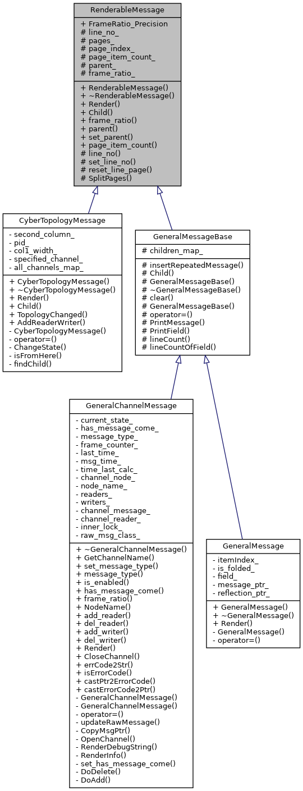

# monitor



# RenderableMessage

有分页的概念，有parent类似树的概念，和 `Child` `Render`方法需要子类实现

# CyberTopologyMessage

最初展示的拓扑信息

```cpp
// in main.cc
auto topologyCallback =
    [&topologyMsg](const apollo::cyber::proto::ChangeMsg &change_msg) {
      topologyMsg.TopologyChanged(change_msg);// 当拓扑结构变化时，topologyMsg也要跟着变化 对应的GeneralChannelMessage变
    };
auto channelManager =
    apollo::cyber::service_discovery::TopologyManager::Instance()
        ->channel_manager();
channelManager->AddChangeListener(topologyCallback);// 监听拓扑结构变化
std::vector<apollo::cyber::proto::RoleAttributes> roleVec;
channelManager->GetWriters(&roleVec);
for (auto &role : roleVec) {
  topologyMsg.AddReaderWriter(role, true);
}
roleVec.clear();
channelManager->GetReaders(&roleVec);
for (auto &role : roleVec) {
  topologyMsg.AddReaderWriter(role, false);
}
Screen *s = Screen::Instance();
signal(SIGWINCH, SigResizeHandle);
signal(SIGINT, SigCtrlCHandle);
  
s->SetCurrentRenderMessage(&topologyMsg);//最初的可渲染信息就是 Readers 和 Writers
```

```cpp
std::map<std::string, GeneralChannelMessage*> all_channels_map_; //所有channel
```

# GeneralChannelMessage/GeneralMessageBase

GeneralMessageBase只实现了child方法，

monitor是怎么根据Message* 打印数据的，**GeneralMessageBase** 中的 `PrintMessage` `PrintField` `lineCount` `lineCountOfField`

[C++ 实用技术 – GOOGLE PROTOBUF反射技术 – 基础API](http://www.sylar.top/blog/?p=115)

[protocol buffer中repeated和map类型的动态解析](http://sstask.github.io/2015/12/11/gpbrepeatedmap/)

## *OpenChannel

GeneralChannelMessage在整个拓扑结构中也是一个读节点, 读对应的channel, 消息来临时updateRawMessage(rawMsg);

## *RenderDebugString/RenderInfo

获取到更新后的RawMessage，各种反射机制反序列化，统计行数，打印字段等等

```cpp
void GeneralChannelMessage::RenderDebugString(const Screen* s, int key,
                                              unsigned lineNo) {
  if (has_message_come()) {
    if (raw_msg_class_ == nullptr) {
      auto rawFactory = apollo::cyber::message::ProtobufFactory::Instance();
      raw_msg_class_ = rawFactory->GenerateMessageByType(message_type());//根据message的类型生成一个message
    }

    if (raw_msg_class_ == nullptr) {
      s->AddStr(0, lineNo++, "Cannot Generate Message by Message Type");
    } else {
      s->AddStr(0, lineNo++, "FrameRatio: ");

      std::ostringstream outStr;
      outStr << std::fixed << std::setprecision(FrameRatio_Precision)
             << frame_ratio();
      s->AddStr(outStr.str().c_str()); // 在某行后追加str

      decltype(channel_message_) channelMsg = CopyMsgPtr();// 取到updateRawMessage后的更新的RawMessage(就是带时间戳的字符串)

      if (channelMsg->message.size()) {
        s->AddStr(0, lineNo++, "RawMessage Size: ");
        outStr.str("");
        outStr << channelMsg->message.size() << " Bytes";
        s->AddStr(outStr.str().c_str());
        if (raw_msg_class_->ParseFromString(channelMsg->message)) {//传输过来的是统一的RawMessage,根据channel_type反射生成对应结构, 在此处反序列化
          int lcount = lineCount(*raw_msg_class_, s->Width()); // 统计要多少行
          page_item_count_ = s->Height() - lineNo;
          pages_ = lcount / page_item_count_ + 1;
          SplitPages(key);//分页
          int jumpLines = page_index_ * page_item_count_;
          jumpLines <<= 2;
          jumpLines /= 5;
          GeneralMessageBase::PrintMessage(this, *raw_msg_class_, jumpLines, s,
                                           lineNo, 0); //打印(写屏幕)
        } else {
          s->AddStr(0, lineNo++, "Cannot parse the raw message");
        }
      } else {
        s->AddStr(0, lineNo++, "The size of this raw Message is Zero");
      }
    }
  } else {
    s->AddStr(0, lineNo++, "No Message Came");
  }
}
```


# GeneralMessage

# Screen

current_render_obj_对象随着选择而变化，调用Render时的表现也不同。