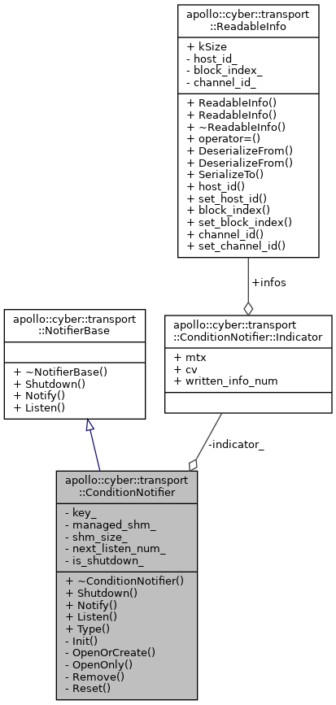
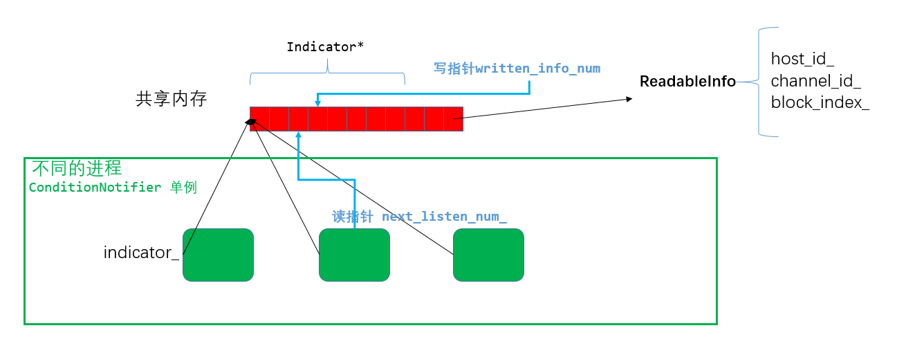

# ConditionNotifier/ReadableInfo




ConditionNotifier继承自基类NotifierBase，实现了Notify，Listen，Shutdown等方法。**配合is_shutdown_标志位操作条件变量**，达到进程间同步

Notify()  加锁，写入数据，写指针前移，notify_all

Listen()  加锁，wait_for，读取数据，读指针前移

Shutdown()  shutdown标志位



- 不同的进程中的同一个单例，指向**相同的共享内存地址**(进程间通信)。

  构造时的**OpenOrCreate**，操作共享内存shmget、shmat、shmctl、shmdt

- 该共享内存用于进程同步的方式是**条件变量和互斥锁**， **PTHREAD_PROCESS_SHARED**(进程间同步)。**多个消费者互不影响**

  ```cpp
  pthread_mutexattr_t mtx_attr;
  pthread_mutexattr_init(&mtx_attr);
  pthread_mutexattr_setpshared(&mtx_attr, PTHREAD_PROCESS_SHARED);
  pthread_mutex_init(indicator_->mtx.native_handle(), &mtx_attr);
  
  pthread_condattr_t cond_attr;
  pthread_condattr_init(&cond_attr);
  pthread_condattr_setpshared(&cond_attr, PTHREAD_PROCESS_SHARED);
  pthread_cond_init(indicator_->cv.native_handle(), &cond_attr);
  ```

- 写指针只有一个，读指针在不同进程中不同。**类似ringbuffer**中的读写指针。


问题：

1 数据以什么形式存放，readableinfo中只是一个索引

2  Notify，Listen 由谁调用

