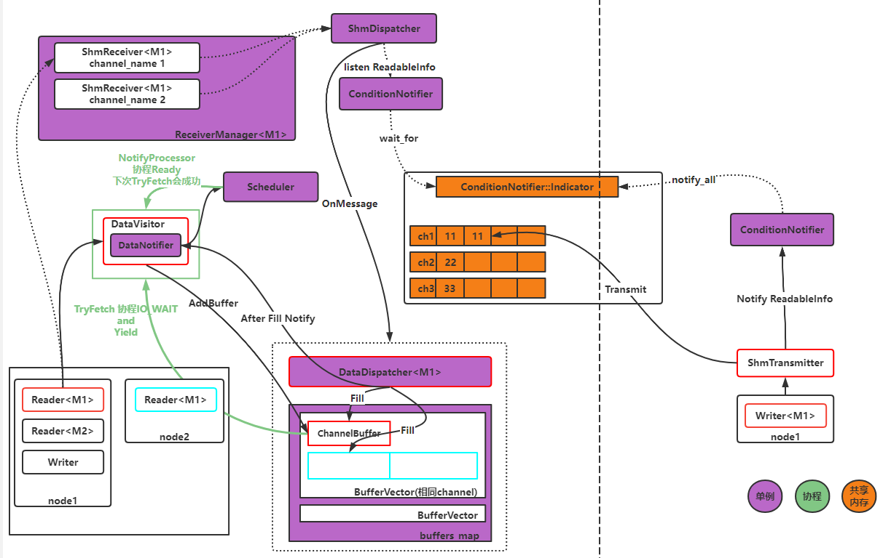

# 一图读懂apollo-cyber中的消息传递 #

**apollo-shm**



apollo中的消息传递按照线程间(指针)，进程间(shm)，主机间(fastrtps实现的dds)分为三类。这里分析下比较常见的进程间通信。

# Reader的创建 #

同一进程可以有多个节点(node)，这些节点可以监听(reader)相同的话题(channel)，话题的个数(msg)也没有限制(4个)。

在reader的`init`方法中，传入了自己的回调，回调中的`BlockerPtr::Enqueue`先不看，`reader_func_`就是我们指定的回调函数，在这里写收到信息后执行的业务逻辑。

```cpp
std::function<void(const std::shared_ptr<MessageT>&)> func;
if (reader_func_ != nullptr) {
  func = [this](const std::shared_ptr<MessageT>& msg) {
    this->Enqueue(msg);
    this->reader_func_(msg);
  };
} else {
  func = [this](const std::shared_ptr<MessageT>& msg) { this->Enqueue(msg); };
}
```

后面创建了一个`data::DataVisitor<MessageT>`数据监视器。可以看到DataVisitor有四种模板类型，可以同时监视1-4种类型的数据。构造时会开辟一块由用户指定大小的`BufferType<T>(CacheBuffer)`和channel_id绑定。同时这块buffer也被注册进了`DataDispatcher<M0>`中，之后一旦channel有数据，就会将数据(智能指针)Fill入这块Buffer。可以看到红色和蓝色的Reader虽然监视相同的话题，但是对应的并不是同一块buffer，因为buffer的size可以由用户指定，所以并没有使用同一块内存，不过存放智能指针的开销也很小。dv还有一个`TryFetch`方法，这个方法之后会在协程中调用，尝试取一次buffer中的数据。

```cpp
// init data visitor
buffer_(configs.channel_id, new BufferType<M0>(configs.queue_size)
DataDispatcher<M0>::Instance()->AddBuffer(buffer_);
```

协程的创建，绑定了dv和回调函数，放入调度中待执行

```cpp
// Using factory to wrap templates.
croutine::RoutineFactory factory =
    croutine::CreateRoutineFactory<MessageT>(std::move(func), dv);
if (!sched->CreateTask(factory, croutine_name_)) {
```

`CreateRoutineFactory`可以看到协程的内部执行的内容就是，设置协程状态为**DATA_WAIT**。尝试取一次数据，取到及回调到用户函数，否则Yield。再后面可以看到调度器只会执行状态为**Ready**的协程，所以在Reader创建好后会执行一次TryFetch函数，如果此时没有数据，协程的状态就是DATA_WAIT，之后除非等到数据到来，否则调度器不会再执行该协程。不会消耗再无意义的遍历Ready协程上。

```cpp
template <typename M0, typename F>//协程在 Scheduler::CreateTask 中创建
RoutineFactory CreateRoutineFactory(
    F&& f, const std::shared_ptr<data::DataVisitor<M0>>& dv) {
  RoutineFactory factory;
  factory.SetDataVisitor(dv);
  factory.create_routine = [=]() {
    return [=]() {
      std::shared_ptr<M0> msg;
      for (;;) {//死循环中的协程，没关系，会Yeild不会阻塞
        CRoutine::GetCurrentRoutine()->set_state(RoutineState::DATA_WAIT);
        if (dv->TryFetch(msg)) {
          f(msg);//用户回调
          CRoutine::Yield(RoutineState::READY);
        } else {
          CRoutine::Yield();
        }
      }
    };
  };
  return factory;
}
```

这里的Receiver是针对消息类型的单例，由ReceiverManager管理。实际是`HybridReceiver`但这里只用到了**ShmReceiver**。又注册了AddListener回调，内容是执行`OnNewMessage`，`OnNewMessage`会执行到Transport::Instance()->CreateReceiver中的回调函数。

```cpp
template <typename M>
void ShmReceiver<M>::Enable() {
  if (this->enabled_) {
    return;
  }

  dispatcher_->AddListener<M>(
      this->attr_, std::bind(&ShmReceiver<M>::OnNewMessage, this,
                             std::placeholders::_1, std::placeholders::_2));
  this->enabled_ = true;
}

//OnNewMessage
void Receiver<M>::OnNewMessage(const MessagePtr& msg,
                               const MessageInfo& msg_info) {
  if (msg_listener_ != nullptr) {
    msg_listener_(msg, msg_info, attr_);// 回调到Receiver构造时传入的回调函数
      // 即Transport::Instance()->CreateReceiver中的回调函数
  }
}
```

Transport::CreateReceiver的回调为`data::DataDispatcher<MessageT>::Instance()->Dispatch`处进行数据派发

总体来说，Receiver作用是，监视某个channel的变化，当对端数据写入共享内存后，会通过层层回调调用对应消息类型的DataDispatcher进行**数据的派发**。

```cpp
receiver_ = ReceiverManager<MessageT>::Instance()->GetReceiver(role_attr_);

receiver_map_[channel_name] =
    transport::Transport::Instance()->CreateReceiver<MessageT>(
        role_attr, [](const std::shared_ptr<MessageT>& msg,
                      const transport::MessageInfo& msg_info,
                      const proto::RoleAttributes& reader_attr) {
          data::DataDispatcher<MessageT>::Instance()->Dispatch(reader_attr.channel_id(), msg);
        });
```

# 消息的传递 #

再写节点创立后，Writer往共享内存中写入数据后。会被`ShmDispatcher::ThreadFunc`中的**Listen**捕获到`readable_info`。首先检查channel_id是不是本进程关注的。之后调用`ShmDispatcher::ReadMessage` -->`ShmDispatcher::OnMessage`,回调到`ShmDispatcher::AddListener` 中绑定的 listener_adapter。图中可以看出，`readable_info`只是声明了channel在内存块的某个idx写入数据，具体数据内容还是要根据共享内存的地址取实际内容。

```cpp
auto listener_adapter = [listener](const std::shared_ptr<ReadableBlock>& rb,
                                     const MessageInfo& msg_info) {
    auto msg = std::make_shared<MessageT>();
    RETURN_IF(!message::ParseFromArray(
        rb->buf, static_cast<int>(rb->block->msg_size()), msg.get())); 
    //在这里反序列化msg数据，msg_info的反序列化在ShmDispatcher::ReadMessage中完成
    listener(msg, msg_info); 
    // 回调到在ShmReceiver<M>::Enable() 中 注册的 ShmReceiver<M>::OnNewMessage 即 Receiver<M>::OnNewMessage
  };
```

回调到了`Receiver<M>::OnNewMessage`，上文中说到过OnNewMessage对应的动作就是DataDispatcher进行**数据的派发**

```cpp
//派发消息，派发完毕后Notify
template <typename T>
bool DataDispatcher<T>::Dispatch(const uint64_t channel_id,
                                 const std::shared_ptr<T>& msg) {
  BufferVector* buffers = nullptr;
  if (apollo::cyber::IsShutdown()) {
    return false;
  }
  if (buffers_map_.Get(channel_id, &buffers)) {
    for (auto& buffer_wptr : *buffers) {
      if (auto buffer = buffer_wptr.lock()) {
        std::lock_guard<std::mutex> lock(buffer->Mutex());
        buffer->Fill(msg);//
      }
    }
  } else {
    return false;
  }
  return notifier_->Notify(channel_id);
  //after Fill channel_id的消息来了，通知到监听对应channel的notifiers，依次执行notifier的cb
}
```

再**派发数据完毕**后，通知到监听对应channel的notifiers，依次执行notifier的cb。

```cpp
//channel_id的消息来了，通知到监听对应channel的notifiers，依次执行notifier的cb
inline bool DataNotifier::Notify(const uint64_t channel_id) {
  NotifyVector* notifies = nullptr;
  if (notifies_map_.Get(channel_id, &notifies)) {
    for (auto& notifier : *notifies) {
      if (notifier->callback) {
        notifier->callback();
      }
    }
    return true;
  }
  return false;
}
```

这个cb是在`Scheduler::CreateTask`中**生成CRoutine**创建的，**通知处理器执行该协程**。

```cpp
if (visitor != nullptr) {
  visitor->RegisterNotifyCallback([this, task_id, name]() {
    if (unlikely(stop_.load())) {
      return;
    }
    this->NotifyProcessor(task_id);// 协程状态设置就绪，notify processor 取协程任务执行
  });
}
```

最终数据来临时，被唤醒的协程TryFetch一定成功，执行到了用户的回调。这种情况下用户回调在不同的协程中执行，如果不在同一个执行器中，那么就不会有阻塞等待问题。你甚至可以在自己的读回调中sleep...

